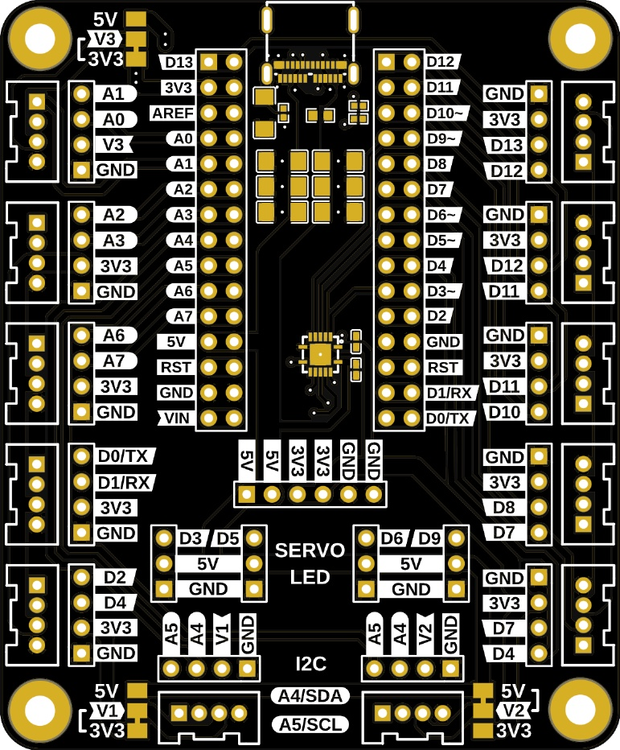

# MicroPython-Examples

A collection of examples and libraries (`/lib`) assembled for my module Tangible Interfaces at [MAInD - SUPSI](https://maind.supsi.ch/master-interaction-design/)

These MicroPython Sketches are used on Arduino Nano RP2040 Connect on a custom Carrier Board developed with MAInD's [Marco Lurati](https://marcolurati.ch), which allows us to connect Grove modules and other peripherals

Used Libraries (re-testing as I go)

* [ubidefeo/micropython-i2c-lcd: 🖥 MicroPython Library for I2C 2x16 LCD Screens](https://github.com/ubidefeo/micropython-i2c-lcd)
* [HT16K33-based LED Matrices](https://github.com/hybotics/Hybotics_Micropython_HT16K33)
* [sandbo00/picoservo: A small class for controlling servos using micropython on the Raspberry Pi Pico](https://github.com/sandbo00/picoservo)
* [pangopi/micropython-DS3231-AT24C32: MicroPython driver for DS3231 RTC and AT24C32 EEPROM module](https://github.com/pangopi/micropython-DS3231-AT24C32)
* [targetblank/micropython\_ahtx0: MicroPython driver for the AHT10 and AHT20 temperature and humindity sensors.](https://github.com/targetblank/micropython\_ahtx0)
* [micropython-gif-viewer/gifviewer.py at master · carledwards/micropython-gif-viewer](https://github.com/carledwards/micropython-gif-viewer/blob/master/gifviewer.py)
* [Getting started — Micropython-Display documentation](https://espresso-ide.readthedocs.io/projects/micropython-oled/en/latest/content/getting\_started.html#example1-py)
* [micropython-rotary/Examples at master · miketeachman/micropython-rotary](https://github.com/miketeachman/micropython-rotary)
* [micropython-rotary/rotary\_irq\_esp.py at master · miketeachman/micropython-rotary](https://github.com/miketeachman/micropython-rotary/blob/master/rotary\_irq\_esp.py)
* [ubidefeo/micropython-dfplayer: CircuitPython library with UART-based interface to DFPlayer-Mini](https://github.com/ubidefeo/micropython-dfplayer)
* [MAX30102-MicroPython-driver/main.py at main · n-elia/MAX30102-MicroPython-driver](https://github.com/n-elia/MAX30102-MicroPython-driver)
* [micropython-thermal-printer/Adafruit\_Thermal.py at master · ayoy/micropython-thermal-printer](https://github.com/ayoy/micropython-thermal-printer/blob/master/Adafruit\_Thermal.py)